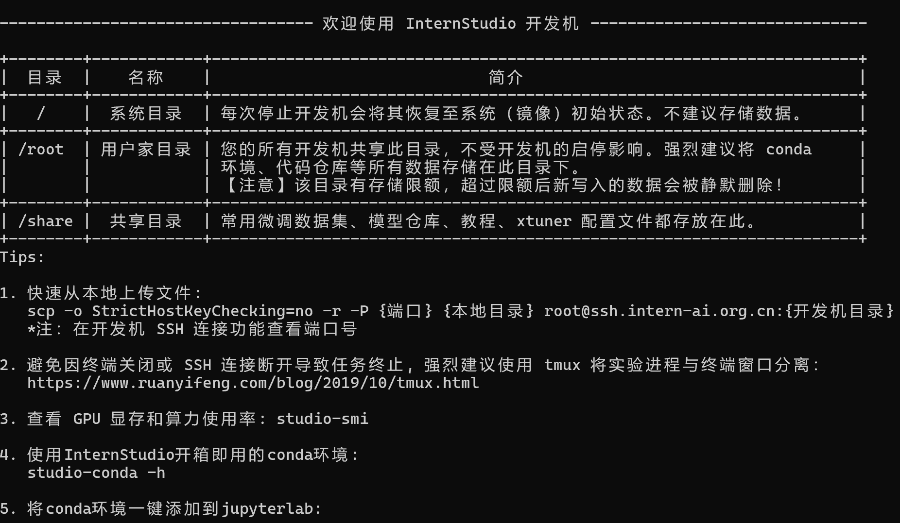
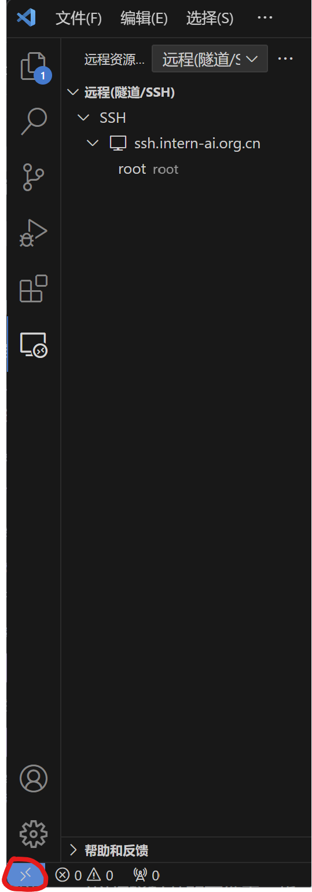
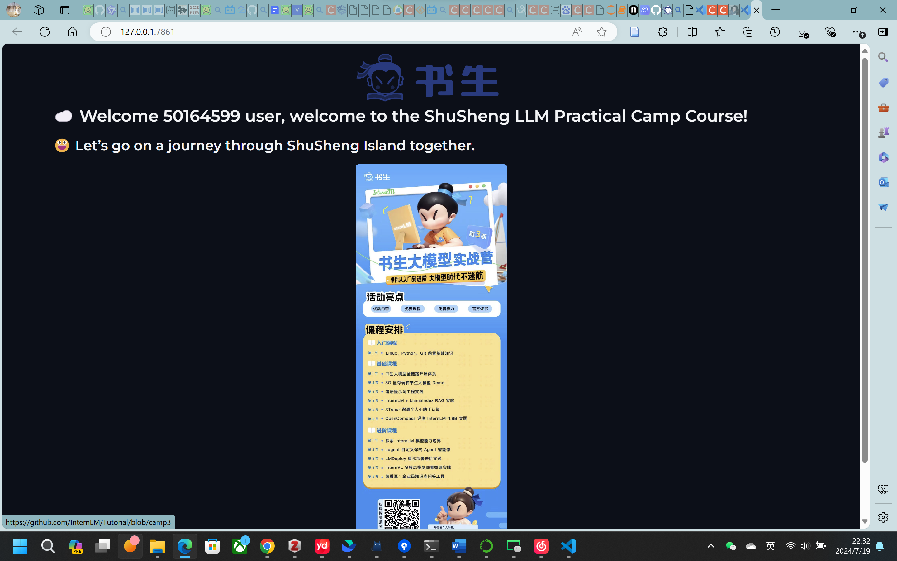

# InternLM 入门岛Linux_Task
### 闯关任务
>完成SSH连接与端口映射并运行hello_world.py

##### 1.创建开发机
##### 2.尝试使用密码进行SSH远程连接
在开发机页面点击SSH连接，把登录命令复制到powershell，并粘贴密码（密码在powershell中不显示是正常的），回车出现如下表示成功

##### 3.使用vscode进行SSH远程连接
首先，安装Remote-SSH插件。

安装完成插件以后，点击侧边栏的远程连接图标，在SSH中点击“+”按钮，添加开发机SSH连接的登录命令。配置文件默认即可。

点击如下图左下按钮，打开远程窗口。


##### 4.进行端口映射
在终端进行端口映射
```
ssh -p 37367 root@ssh.intern-ai.org.cn -CNg -L 7860:127.0.0.1:7860 -o StrictHostKeyChecking=no
```
创建一个hello_world.py文件
```python
import socket
import re
import gradio as gr
 
# 获取主机名
def get_hostname():
    hostname = socket.gethostname()
    match = re.search(r'-(\d+)$', hostname)
    name = match.group(1)
    
    return name
 
# 创建 Gradio 界面
with gr.Blocks(gr.themes.Soft()) as demo:
    html_code = f"""
            <p align="center">
            <a href="https://intern-ai.org.cn/home">
                
            </a>
            </p>
            <h1 style="text-align: center;">☁️ Welcome {get_hostname()} user, welcome to the ShuSheng LLM Practical Camp Course!</h1>
            <h2 style="text-align: center;">😀 Let’s go on a journey through ShuSheng Island together.</h2>
            <p align="center">
                <a href="https://github.com/InternLM/Tutorial/blob/camp3">
                    
                </a>
            </p>

            """
    gr.Markdown(html_code)

demo.launch()
```
先在vscode里的终端pip install gradio==4.29.0安装依赖包，再运行python代码。

结果如下：



