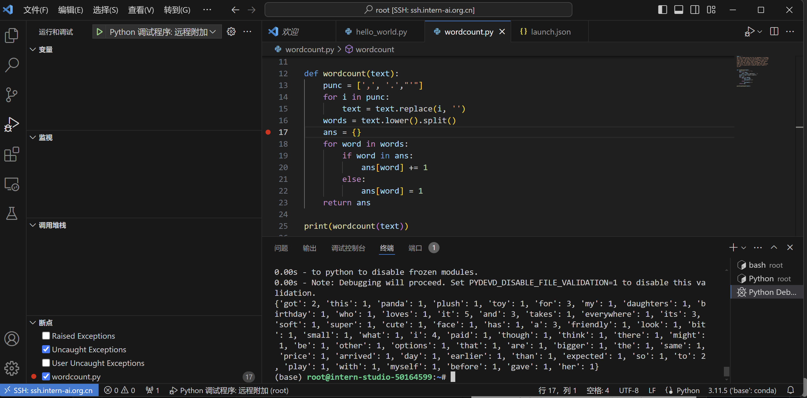

# InternLM 入门岛Python_Task
### 任务一
请实现一个wordcount函数，统计英文字符串中每个单词出现的次数。返回一个字典，key为单词，value为对应单词出现的次数。
Eg:

Input:

```python
"""Hello world!  
This is an example.  
Word count is fun.  
Is it fun to count words?  
Yes, it is fun!"""
```

Output:

```python
{'hello': 1, 'world': 1, 'this': 1, 'is': 4, 'an': 1, 'example': 1, 'word': 1, 'count': 2,
'fun': 3, 'it': 2, 'to': 1, 'words': 1, 'yes': 1}
```

TIPS：记得先去掉标点符号,然后把每个单词转换成小写。不需要考虑特别多的标点符号，只需要考虑实例输入中存在的就可以。

```python
text = """
Got this panda plush toy for my daughter's birthday,
who loves it and takes it everywhere. It's soft and
super cute, and its face has a friendly look. It's
a bit small for what I paid though. I think there
might be other options that are bigger for the
same price. It arrived a day earlier than expected,
so I got to play with it myself before I gave it
to her.
"""

def wordcount(text):
    pass

```
**代码：**
```python
text = '''
Got this panda plush toy for my daughter's birthday,
who loves it and takes it everywhere. It's soft and
super cute, and its face has a friendly look. It's
a bit small for what I paid though. I think there
might be other options that are bigger for the
same price. It arrived a day earlier than expected,
so I got to play with it myself before I gave it
to her.
'''

def wordcount(text):
    punc = [',', '.',"'"]
    for i in punc:
        text = text.replace(i, '')
    words = text.lower().split()
    ans = {}
    for word in words:
        if word in ans:
            ans[word] += 1
        else:
            ans[word] = 1
    return ans

print(wordcount(text))
```
##### 输出结果：
```python
{'got': 2, 'this': 1, 'panda': 1, 'plush': 1, 'toy': 1, 'for': 3, 'my': 1, 'daughters': 1, 'birthday': 1, 'who': 1, 'loves': 1, 'it': 5, 'and': 3, 'takes': 1, 'everywhere': 1, 'its': 3, 'soft': 1, 'super': 1, 'cute': 1, 'face': 1, 'has': 1, 'a': 3, 'friendly': 1, 'look': 1, 'bit': 1, 'small': 1, 'what': 1, 'i': 4, 'paid': 1, 'though': 1, 'think': 1, 'there': 1, 'might': 1, 'be': 1, 'other': 1, 'options': 1, 'that': 1, 'are': 1, 'bigger': 1, 'the': 1, 'same': 1, 'price': 1, 'arrived': 1, 'day': 1, 'earlier': 1, 'than': 1, 'expected': 1, 'so': 1, 'to': 2, 'play': 1, 'with': 1, 'myself': 1, 'before': 1, 'gave': 1, 'her': 1}
```
### 任务二

请使用本地vscode连接远程开发机，将上面你写的wordcount函数在开发机上进行debug，体验debug的全流程，并完成一份debug笔记(需要截图)。


**回答背景：已尝试过debug，即已在终端pip install debugpy**

step1设置断点

step2点击使用launch.json进行测试

step3 选择远程附加

step4 在命令行中发起debug

step5 点击绿色小箭头开始debug

可看到进入debug

点击继续，直至debug结束，显示运行结果
